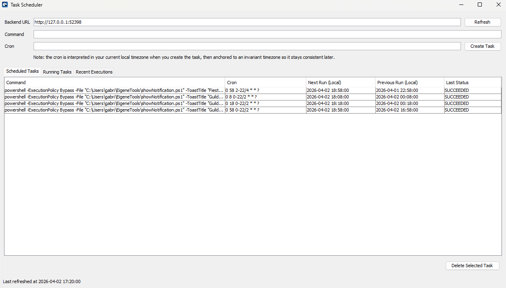

# Task Scheduler

Small local task scheduler with two Java modules:

- `backend`: local HTTP API + Quartz-based scheduling + JSON persistence
- `frontend`: Swing desktop UI for creating, editing, listing, and deleting tasks

## Table Of Contents

- [Requirements](#requirements)
- [Build](#build)
- [Start The Backend](#start-the-backend)
- [Custom Port](#custom-port)
- [Schedule Timezone](#schedule-timezone)
- [Start The Frontend](#start-the-frontend)
- [Backend API](#backend-api)
- [Create A Task](#create-a-task)
- [List Tasks, Running Processes, And Recent Results](#list-tasks-running-processes-and-recent-results)
- [Delete A Task](#delete-a-task)
- [Update A Task](#update-a-task)
- [Cron Notes](#cron-notes)
- [Persistence](#persistence)
- [What Gets Stored](#what-gets-stored)
- [Typical Run Flow](#typical-run-flow)

## Requirements

- Java 21

The project already includes a Maven wrapper, so you do not need Maven installed globally.

## Build

From the project root:

```powershell
.\mvnw.cmd package
```

This creates runnable jars in:

- `backend\target\backend-1.1.0.jar`
- `frontend\target\frontend-1.1.0.jar`
- `frontend\target\task-scheduler.exe`

## Start The Backend

From the project root:

```powershell
java -jar backend\target\backend-1.1.0.jar
```

Default backend URL:

- `http://127.0.0.1:52398`

The backend keeps running until you stop it with `Ctrl+C`.

### Custom Port

You can override the default port with a JVM system property:

```powershell
java "-Dtask.scheduler.port=18080" -jar backend\target\backend-1.1.0.jar
```

You can also use the environment variable `TASK_SCHEDULER_PORT`.

### Schedule Timezone

By default, each new task uses the machine's current local timezone offset as its starting point, then keeps that offset fixed.

This is equivalent to converting the entered local schedule into a fixed UTC schedule at creation time. The cron text itself stays readable, but Quartz evaluates it using the captured fixed offset.

That means schedules do not follow daylight saving time automatically after creation. Instead, each task keeps the fixed offset it started with, which makes execution times predictable.

Example:

- if you create a task during MEZ, it is anchored to `UTC+01:00`
- if you create a task during MESZ, it is anchored to `UTC+02:00`
- if you create a task at `01:00` while you are in MESZ, it runs at `01:00` while MESZ is active and later runs at `00:00` after the switch back to MEZ
- if you create a task at `00:00` while you are in MEZ, it will run at `01:00` during MESZ

You can override the scheduling timezone with:

- JVM property `-Dtask.scheduler.timezone=<ZoneId>`
- environment variable `TASK_SCHEDULER_TIMEZONE`

Examples:

- `+01:00` for fixed MEZ behavior
- `+02:00` for fixed MESZ behavior
- `Europe/Berlin` if you want the schedule to follow local DST changes

## Start The Frontend

Open a second terminal in the project root and run:

```powershell
java -jar frontend\target\frontend-1.1.0.jar
```

Or launch the generated Windows executable:

```powershell
.\frontend\target\task-scheduler.exe
```

This `.exe` uses Java from the local machine environment.

The Swing app opens a small dashboard where you can:

- enter the backend URL
- create a task from a cron expression and command
- load a scheduled task into the form and update its cron or command
- temporarily disable or re-enable a selected scheduled task
- refresh the current scheduler state
- delete a selected scheduled task
- inspect running tasks and recent execution results
- hover table cells to see full command text for long entries



By default the frontend points at:

- `http://127.0.0.1:52398`

If you started the backend on another port, update the URL field in the UI.

## Backend API

Base URL:

- `http://127.0.0.1:52398`

Endpoints:

- `POST /api/tasks`
- `GET /api/tasks`
- `PUT /api/tasks/{uuid}`
- `POST /api/tasks/{uuid}/disable`
- `POST /api/tasks/{uuid}/enable`
- `DELETE /api/tasks/{uuid}`

### Create A Task

```powershell
$body = @{
  cronExpression = "*/30 * * * *"
  command = "echo hello"
} | ConvertTo-Json

Invoke-RestMethod `
  -Uri "http://127.0.0.1:52398/api/tasks" `
  -Method Post `
  -ContentType "application/json" `
  -Body $body
```

Request fields:

- `cronExpression`: cron string
- `command`: console command to execute

Response fields include:

- generated `id`
- normalized `cronExpression`
- `command`
- `createdAt`
- `scheduleTimeZone`
- `enabled`

### List Tasks, Running Processes, And Recent Results

```powershell
Invoke-RestMethod -Uri "http://127.0.0.1:52398/api/tasks" -Method Get
```

Current response structure:

- `scheduledTasks`
- `runningTasks`
- `recentExecutions`

The `nextRunAt` and `previousRunAt` timestamps are absolute instants. The frontend shows them in your current local timezone.

Disabled tasks remain stored and visible, but they do not have a next execution time until you enable them again.

### Delete A Task

```powershell
Invoke-RestMethod `
  -Uri "http://127.0.0.1:52398/api/tasks/<uuid>" `
  -Method Delete
```

### Update A Task

```powershell
$body = @{
  cronExpression = "15 * * * *"
  command = "echo updated"
} | ConvertTo-Json

Invoke-RestMethod `
  -Uri "http://127.0.0.1:52398/api/tasks/<uuid>" `
  -Method Put `
  -ContentType "application/json" `
  -Body $body
```

Updating a task keeps the same `id` and `createdAt`.

If you change the cron expression, the backend captures the current configured timezone again and anchors the updated schedule to that timezone.

### Temporarily Disable A Task

```powershell
Invoke-RestMethod `
  -Uri "http://127.0.0.1:52398/api/tasks/<uuid>/disable" `
  -Method Post
```

### Re-Enable A Task

```powershell
Invoke-RestMethod `
  -Uri "http://127.0.0.1:52398/api/tasks/<uuid>/enable" `
  -Method Post
```

## Cron Notes

Quartz uses a cron format with a leading seconds field, and it requires either day-of-month or day-of-week to be `?` when the other one is used. For convenience, this project accepts standard 5-field cron expressions and converts them into the equivalent Quartz form internally.

Examples:

- `"* * * * *"` becomes `"0 * * * * ?"`
- `"*/30 * * * *"` becomes `"0 */30 * * * ?"`
- `"*/10 * * * * ?"` is already a Quartz-style expression

## Persistence

The backend stores scheduled tasks and execution history in:

```text
data\scheduler-state.json
```

On startup, the backend reads this file and restores known jobs.

## What Gets Stored

Each scheduled task contains:

- `id`
- `cronExpression`
- `command`
- `createdAt`
- `scheduleTimeZone`

Each execution record contains:

- execution timestamps
- task id
- command
- exit code
- execution status
- message

## Typical Run Flow

1. Build with `.\mvnw.cmd package`
2. Start the backend
3. Start the frontend
4. Create tasks in the frontend
5. Leave the backend running so Quartz can trigger jobs
